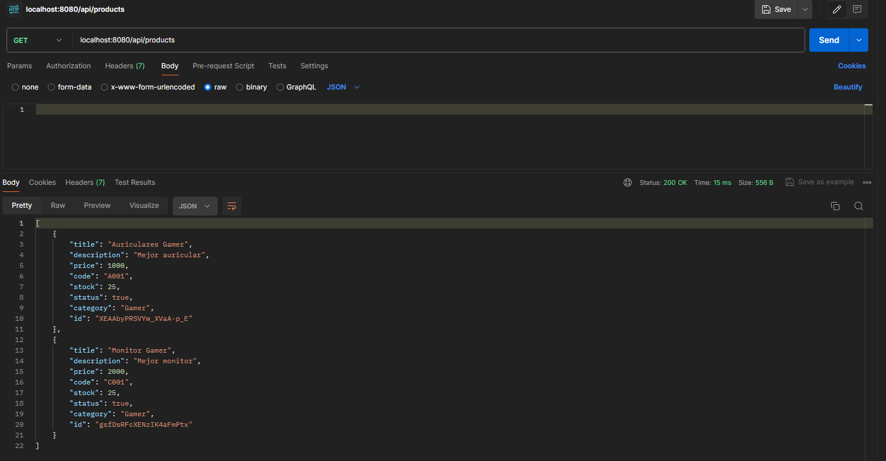
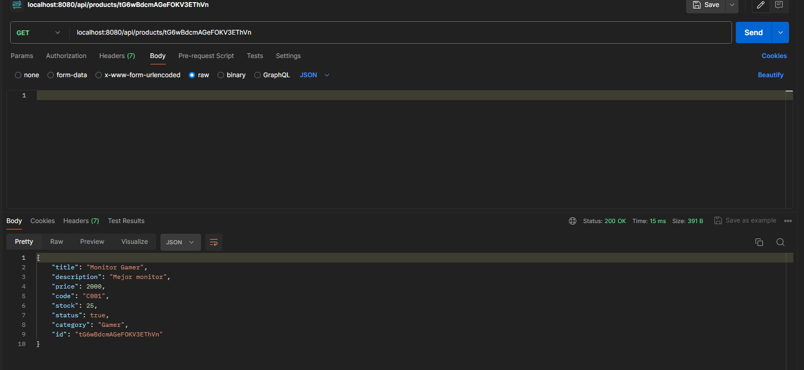

### Proyect backend
##### Clarification: in the terminal with npm run dev the localhost runs
###### Images testing functionality

###### Post

###### Get

###### Product updated by id

###### Deleted by id

###### Product updated by id

###### Cart added

###### Searched by id the cart

###### Product added to cart

###### I do not validate the IDs because they are generated automatically and always different.